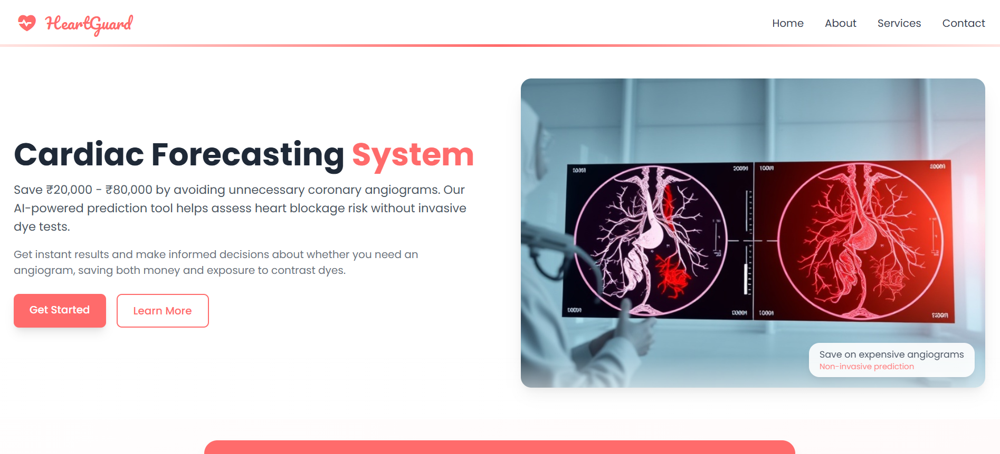
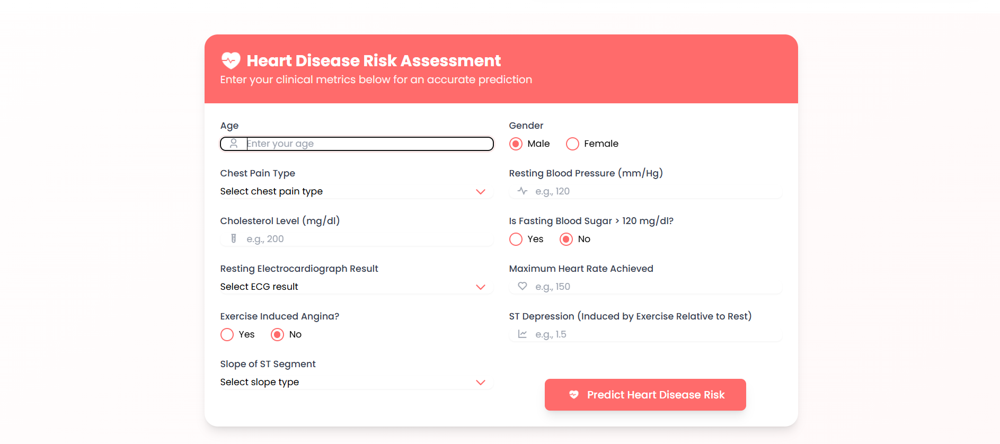
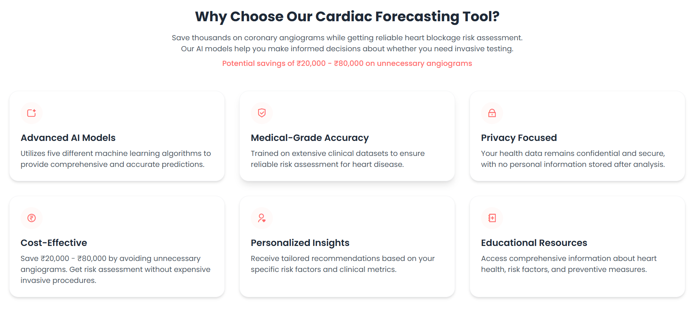
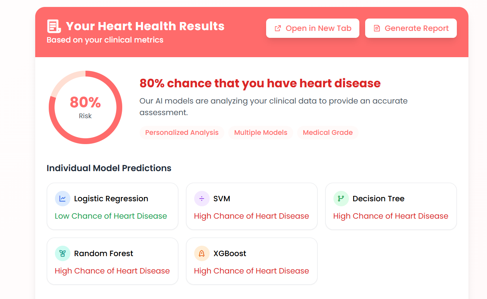
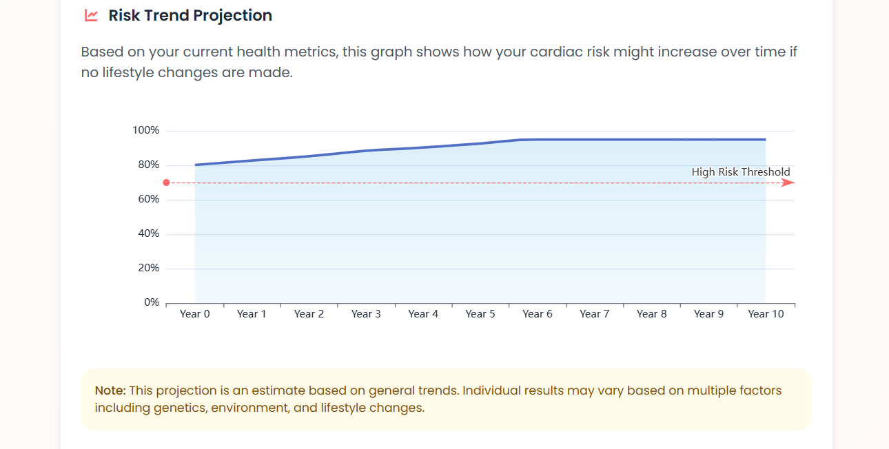
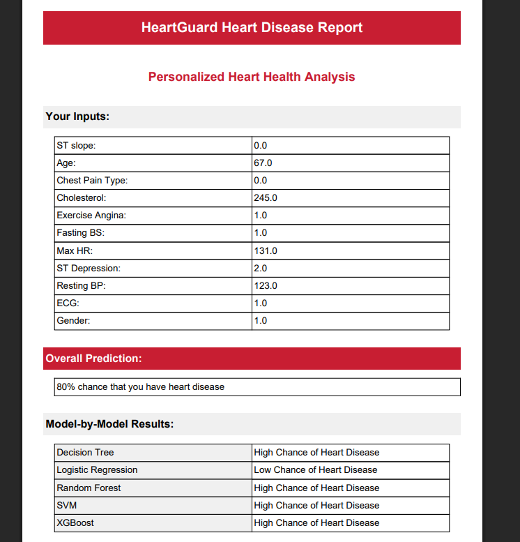
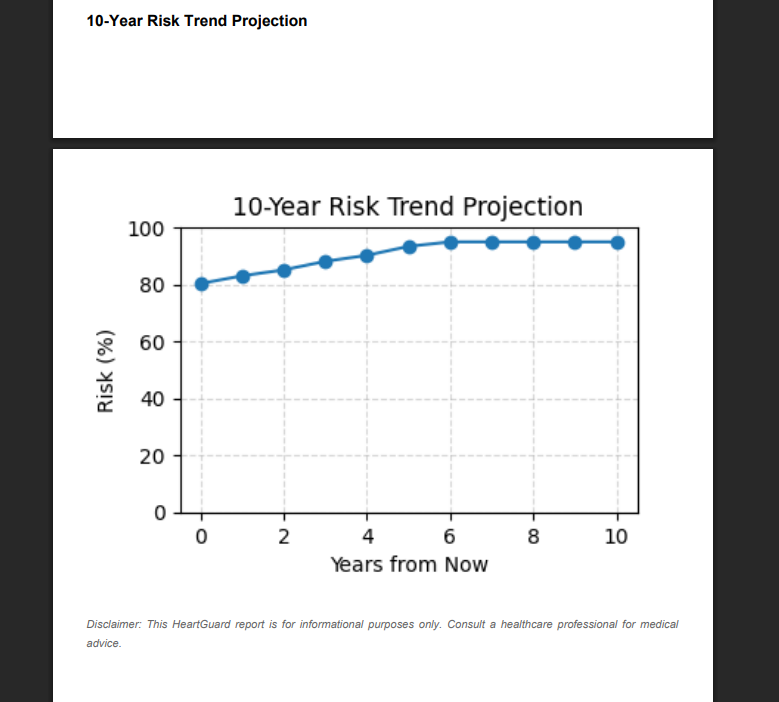

# 🚀 Cardiac Forecasting System (HeartGuard)

  
🔗 **Repository:** https://github.com/anasrobo/Cardiac_Forecasting_System/tree/main

---

## 💡 Project Overview
**HeartGuard** is a Flask‑powered web app that predicts your heart disease risk using **11 non‑invasive clinical features**.  
By excluding the angiogram‑based **“ca”** feature, we help you dodge unnecessary invasive tests and save ₹20,000–₹80,000 per procedure.

---

## 📊 Key Features
- 🏷️ **Binary Classification:** High vs. low chance of heart disease  
- 🔍 **11 Core Metrics:** Age, sex, chest pain, BP, cholesterol, ECG, FBS, HR, angina, ST‑depression, ST‑slope  
- 🚫 **No “ca” Feature:** Avoids reliance on invasive angiogram data  
- 🤖 **Multi‑Model Soft Ensemble:** Logistic Regression, SVM, Decision Tree, Random Forest, XGBoost  
- 🌐 **Flask Web App:** Slick UI in `templates/index.html`  
- 📄 **PDF Reports:** Downloadable summary with trend charts  

---

## 🗂️ Dataset
1. **Primary**: [Cleveland + Hungary Final Dataset](https://www.kaggle.com/datasets/sid321axn/heart-statlog-cleveland-hungary-final)  
2. **Excluded**:  
   - “Heart Disease Data” (contains “ca” feature)  
   - `heart.csv` (723 duplicates)  
   - A4_Cardiac_Disease.csv (too many duplicates)  
   - Tiny datasets (< 400 rows)

---

## ⚙️ Installation
git clone https://github.com/anasrobo/Cardiac_Forecasting_System.git
cd Cardiac_Forecasting_System

python3 -m venv venv
#macOS/Linux
source venv/bin/activate  
#Windows
.\venv\Scripts\activate
pip install -r requirements.txt
No requirements.txt?
pip install flask pandas scikit-learn joblib fpdf matplotlib

# 🚀 Usage
Explore & Train
jupyter notebook Cardiac_Forecasting_Tool.ipynb
Run Flask App

#macOS/Linux
export FLASK_APP=app.py   
#Windows
set FLASK_APP=app.py

# Flask run
– Open 👉 http://127.0.0.1:5000
– Fill out your clinical metrics
– Get instant risk % & per‑model breakdown
– Hit “Generate Report” to snag a PDF

# 📸 Screenshots
1. Hero Section & Overview

2. Input Form UI

3. Features and Benefits

4. Testimonials & Footer

(Adjust file names/paths if you rename your images.)

5. Predictions

6. Risk Forecasting

7. PDF Report Predictions page-1

8. PDF Report Predictions page-2

# 🌟 Roadmap
 🎨 Responsive UI revamp with React

 🧪 Unit tests + CI/CD pipeline

 ☁️ Deploy to Heroku / Render / AWS

 📦 Dockerize for one‑click launch

# 🤝 Contributing
Fork & clone

Create branch:
git checkout -b feature/your-awesome-feature
Commit & push:
git commit -m "✨ Add awesome feature"
git push origin feature/your-awesome-feature
Open a PR — let’s collab! 🚀

# 📄 License
Licensed under MIT. See LICENSE for details.

“The best way to predict the future is to create it.” – Peter Drucker

# Made with ❤️ by Anas
